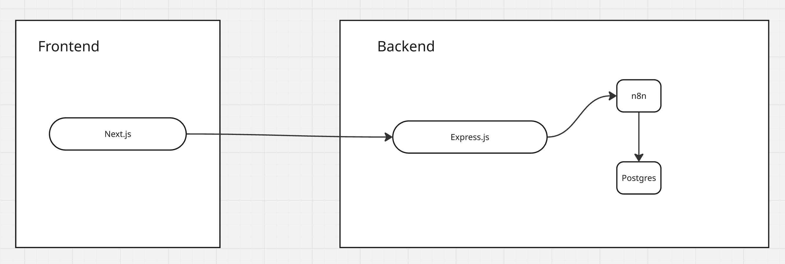
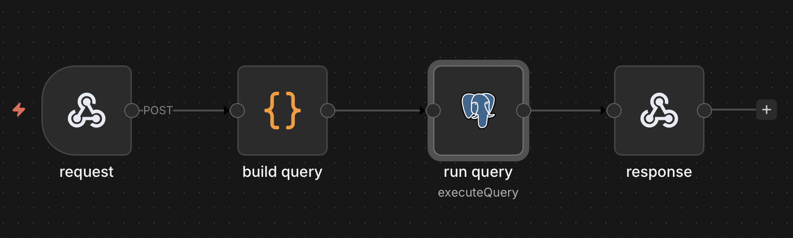
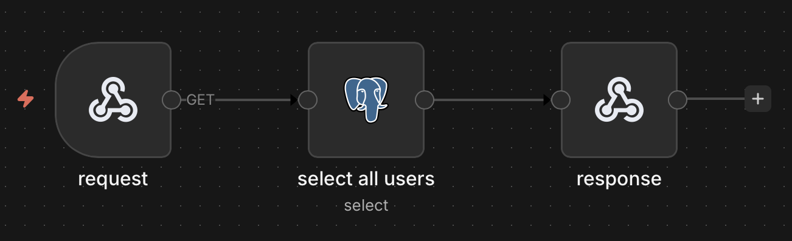
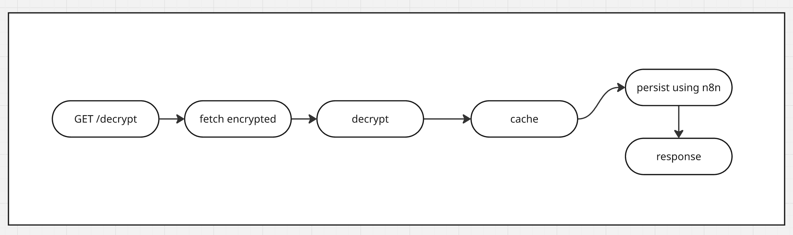
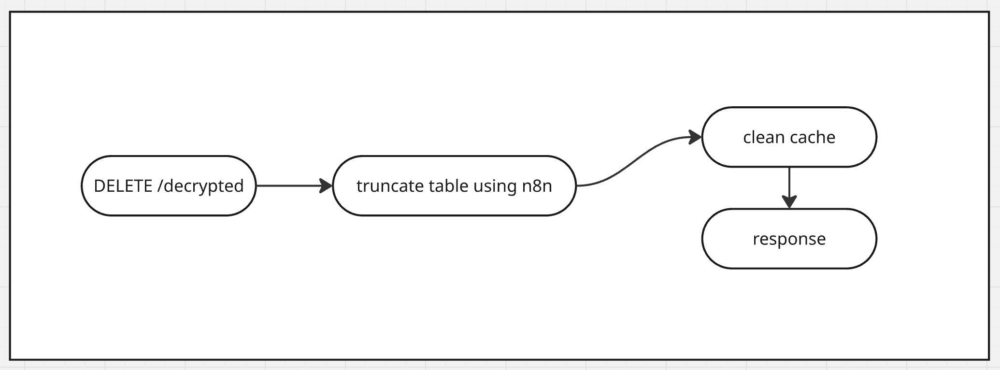
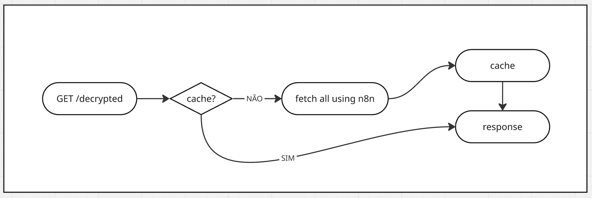

# 📘 Fullstack Teste – H&W Publishing

Este repositório contém a solução para o desafio de Desenvolvedor Fullstack da **H&W Publishing**.

A aplicação integra **Node.js/Express**, **N8N**, **PostgreSQL** e um frontend em **React/Next.js**, criando um fluxo completo de dados entre backend, automação e interface.

---

## 🚀 Tecnologias Utilizadas

### Backend

- **Node.js / Express** – API RESTful
- **N8N** – Automação de workflows
- **PostgreSQL** – Banco de dados relacional

### Frontend

- **React / Next.js** – Framework de frontend
- **Biblioteca de estilos** – Tailwind, Shadcn

---

## 👨‍🎨 Arquitetura

---

## 📊 Fluxogramas

### Workflows N8N

#### Workflow de persistência

#### Workflow de exclusão

#### Workflow de listagem

### Workflows API

#### Workflow de persistência

#### Workflow de exclusão

#### Workflow de listagem

---

## 🌐 Deploy

A aplicação está disponível em: [https://hnw.devguerreiro.com.br](https://hnw.devguerreiro.com.br)
